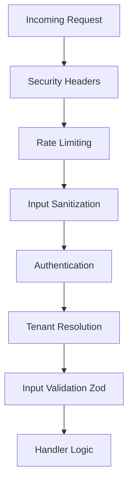

# Tenet Framework

**Build on Solid Fundamentals.** An enterprise-grade, opinionated API framework for Node.js that puts security, compliance, and developer experience first.

[](https://www.typescriptlang.org/)
[](https://nodejs.org/)
[](https://expressjs.com/)
[](https://prisma.io/)
[](LICENSE)

## 🧠 Philosophy

### Security by Default
Most frameworks make you "opt-in" to security. Tenet is **opt-out**. By default, endpoints have strict input sanitization, rate limiting, and security headers.

### Configuration over Boilerplate
Stop writing the same 20 lines of middleware. Use our declarative `HandlerConfig` to define authentication, validation, and auditing rules in one place.

### Type Safety
Types flow automatically from your Zod schemas to your route handlers and database queries.

---

## 📚 Documentation

Detailed documentation is available in the `docs/` directory:

- **[API Reference](docs/API.md)**: Main entry point for all exports.
- **[Handler Guide](docs/api/handlers.md)**: How to use `createPublicHandler`, `createAuthenticatedHandler`, etc.
- **[Multi-Tenancy](docs/architecture/multi-tenancy.md)**: Isolation strategies and tenant resolution.
- **[Security Features](docs/security/features.md)**: CSRF, Rate Limiting, Encryption.
- **[Audit System](docs/api/audit.md)**: Compliance logging and identifying users.

---

## ⚡ Quick Start

### 1. Installation

```bash
npm install @tenet/api zod @prisma/client
```

### 2. Create a Public Endpoint

```typescript
import { createPublicHandler, z } from '@tenet/api';

// GET /api/health
export const healthCheck = createPublicHandler({
  schema: z.object({
    echo: z.string().optional(),
  }),
  handler: async ({ input }) => {
    return { status: 'ok', echo: input.echo };
  },
});
```

### 3. Create an Authenticated Endpoint

```typescript
import { createAuthenticatedHandler, z } from '@tenet/api';

// POST /api/profile
export const updateProfile = createAuthenticatedHandler({
  schema: z.object({
    name: z.string().min(2),
  }),
  handler: async ({ input, user, prisma }) => {
    // User is guaranteed to be present and authenticated
    return await prisma.user.update({
      where: { id: user.id },
      data: { name: input.name },
    });
  },
});
```

### 4. Create a Multi-Tenant Endpoint

```typescript
import { createTenantHandler, z } from '@tenet/api';

// GET /api/projects
export const listProjects = createTenantHandler({
  handler: async ({ prisma }) => {
    // Prisma client is automatically scoped to the current tenant!
    // WHERE tenantId = ? is injected automatically.
    return await prisma.project.findMany();
  },
});
```

---

## 🔒 Security Features

- **Authentication**: JWT, API Keys, and OAuth strategies.
- **Sanitization**: Auto-strips dangerous characters from HTML/SQL inputs.
- **Rate Limiting**: Distributed Redis-based limits per user/IP.
- **Encryption**: AES-256 helper for sensitive database fields.
- **Compliance**: SOC2-ready Audit Logs.

## 🏗️ Architecture



## 🤝 Contributing

Please read [CONTRIBUTING.md](CONTRIBUTING.md) for details on our code of conduct and the process for submitting pull requests.

## 📄 License

This project is licensed under the MIT License - see the [LICENSE](LICENSE) file for details.
