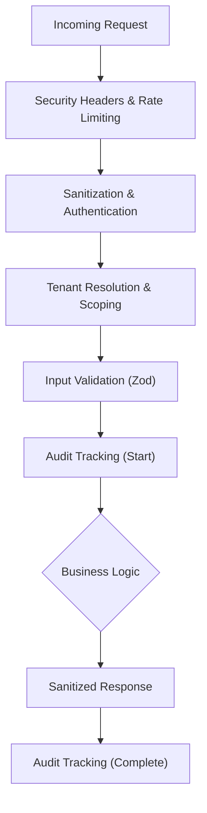

# Tenet Framework
[](https://www.typescriptlang.org/)
[](https://nodejs.org/)
[](https://expressjs.com/)
[](https://prisma.io/)
[](LICENSE)

**Secure, Enterprise-Grade API Framework for Node.js**

Tenet is a high-level framework built on top of Express and Prisma, designed to automate the repetitive security and compliance aspects of modern API development. It enforces a "Security by Default" philosophy, allowing developers to focus entirely on business logic while the framework handles the heavy lifting of multi-tenancy, auditing, and threat mitigation.

---

## 🎨 Philosophy: Security by Default

Tenet was built to eliminate "middleware fatigue." Instead of manually configuring security layers for every route, you define your requirements declaratively.

- **🛡️ Shielded Endpoints**: Every handler automatically receives CSRF protection, IP/User rate-limiting, and XSS/SQLi sanitization.
- **🏗️ Structured Business Logic**: No more hunting through parameters. Handlers receive a pre-validated, typed context including the user, tenant, and a scoped database client.
- **📜 Compliance native**: Enterprise-grade audit trails are generated as a side-effect of execution, tracking changes and access for SOC2/GDPR compliance.

---

## ⚡ Getting Started

### 1. Installation

Since Tenet is currently in active development and not yet on the public NPM registry, it should be integrated via cloning or linking.

```bash
# Clone and setup
git clone https://github.com/RkayG/tenet.git && cd tenet
pnpm install

# Configure environment
cp .env.example .env

# Generate Prisma client
pnpm db:generate
```

### 2. Integration (Local usage)

To use Tenet in your project, link it globally:
```bash
# In the tenet directory
pnpm link --global

# In your project directory
pnpm link --global @tenet/api
```

---

## 🚀 One-Minute Intro

Here is how you define a secure, multi-tenant endpoint in Tenet. Notice the lack of manual validation or security middleware.

```typescript
import { createTenantHandler, z } from '@tenet/api';

// GET /api/projects
export const listProjects = createTenantHandler({
  schema: z.object({
    status: z.enum(['ACTIVE', 'ARCHIVED']).optional(),
  }),
  handler: async ({ input, prisma, tenant }) => {
    // 1. input is fully typed (Zod)
    // 2. prisma is automatically scoped to current tenant
    // 3. Operation is automatically audited
    return await prisma.project.findMany({
      where: { status: input.status },
    });
  },
});
```

---

## 📚 Documentation

Explore our detailed documentation for architecture deep-dives and full API references:

- **[API Reference](docs/API.md)** – Core exports, factories, and utility types.
- **[Handler Guide](docs/api/handlers.md)** – Deep dive into `createPublicHandler`, `createAuthenticatedHandler`, etc.
- **[Multi-Tenancy](docs/architecture/multi-tenancy.md)** – Isolation strategies and tenant resolution.
- **[Security & Audit](docs/security/features.md)** – Details on the auditing and threat mitigation engines.

---

## 🏗️ Architecture


```mermaid
graph TD
    A[Incoming Request] --> B["Security Headers & Rate Limiting"]
    B --> C["Sanitization & Authentication"]
    C --> D[Tenant Resolution & Scoping]
    D --> E["Input Validation (Zod)"]
    E --> F["Audit Tracking (Start)"]
    F --> G{Business Logic}
    G --> H[Sanitized Response]
    H --> I["Audit Tracking (Complete)"]
```

## 🚀 Examples

The repository includes a suite of examples demonstrating enterprise patterns:
- **`pnpm dev:basic-api`**: Full User Management CRUD with auth and audit.
- **`pnpm dev:multi-tenant`**: Complex multi-tenant project management.

---

## 🤝 Contributing

Contributions are welcome! Please see [CONTRIBUTING.md](CONTRIBUTING.md) for our development workflow.

---

## 📄 License

This project is licensed under the MIT License - see the [LICENSE](LICENSE) file for details.
