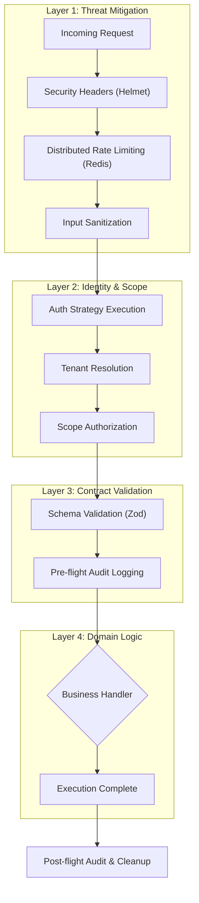

# Architecture Overview: Tenet Framework

Tenet is a modular, event-driven API framework for Node.js, specifically engineered for building secure, multi-tenant SaaS applications at scale. This document provides a technical deep-dive into the architectural principles and implementation details that define the framework.

---

## 🏛️ Architectural Principles

Tenet is built on three core pillars that prioritize application integrity and developer velocity:

### 1. Unified Request Pipeline
Classic Express development often leads to fragmented middleware logic. Tenet consolidates security, authentication, and validation into a single execution pipeline governed by a declarative `HandlerConfig`. This ensures that every endpoint inherits the same set of protections without manual configuration.

### 2. Context-Driven Execution
Business logic within a Tenet handler is "context-aware." Instead of interacting with raw request objects, logic is executed within a `HandlerContext` that provides:
- **Pre-validated Input**: Strictly typed data guaranteed to match the Zod schema.
- **Identity & Scope**: A verified User identity and a resolved Tenant context.
- **Automatic Scoping**: A database client (Prisma) that is automatically injected with filters based on the current tenant.

### 3. "Security by Default"
The framework assumes a hostile environment and applies defensive measures by default. All mutations (POST/PUT/PATCH/DELETE) require CSRF tokens, and all inputs are sanitized for common XSS and SQL injection patterns before reaching the validation layer.

---

## 🏗️ Technical Implementation

### The Multi-Tenant Isolation Model
Tenet implements multi-tenancy at the **Application Layer** using Prisma Client Extensions. By wrapping the database client, Tenet intercepts all outgoing queries and injects tenant-specific `WHERE` clauses (e.g., `WHERE tenant_id = '...'`). This approach provides robust data isolation and prevents cross-tenant data leaks without the overhead of maintaining separate database instances for every tenant. For a deeper dive into available strategies, see the **[Multi-Tenancy Guide](multi-tenancy.md)**.

### Enterprise-Grade Auditing
Observability is integrated directly into the request lifecycle. The framework generates two types of high-fidelity logs:
1. **Request Audits**: Tracks the *Who*, *What*, and *When* for every endpoint.
2. **Resource Audits**: Specialized tracking for state changes, recording before/after values for critical data updates.
These logs are severity-rated and stored in a format compatible with SOC2 and GDPR compliance requirements.

---

## 🔄 Execution Lifecycle

The requested traverses through four distinct layers within the Tenet engine:

### Infrastructure Requirements
Tenet is designed to be cloud-native and horizontally scalable:
- **Application**: Pure Node.js (v18+) with Express.
- **Statelessness**: All session and rate-limit data is stored in **Redis**, allowing multiple framework instances to share a global security state.
- **Data Persistence**: Officially supports **PostgreSQL** and **MySQL** via Prisma, leveraging modern RDBMS features for efficient tenant isolation.

---

## 🚀 Design Philosophy Summary

Tenet is not just a library; it is a **standard for backend engineering**. By enforcing these patterns, organizations ensure that their backend systems remain consistent, secure, and easy to audit, regardless of the developer who built them.
